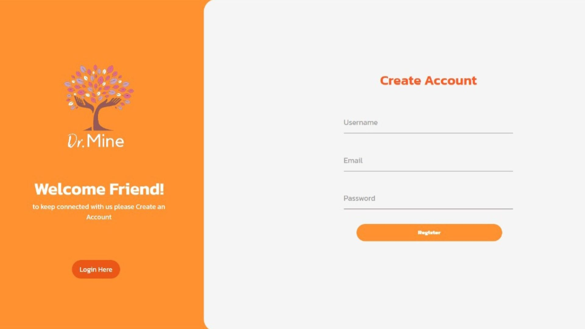
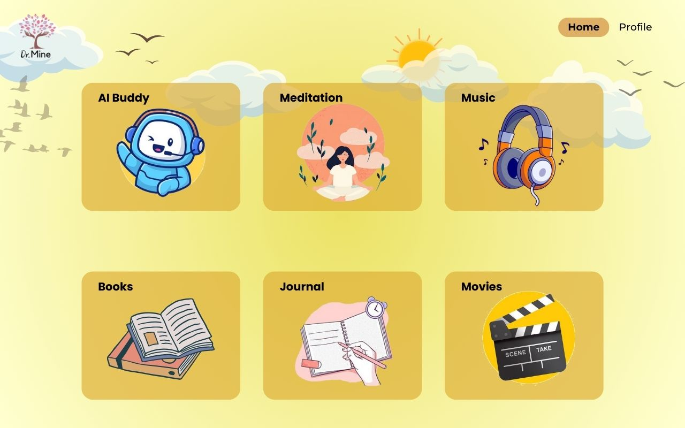
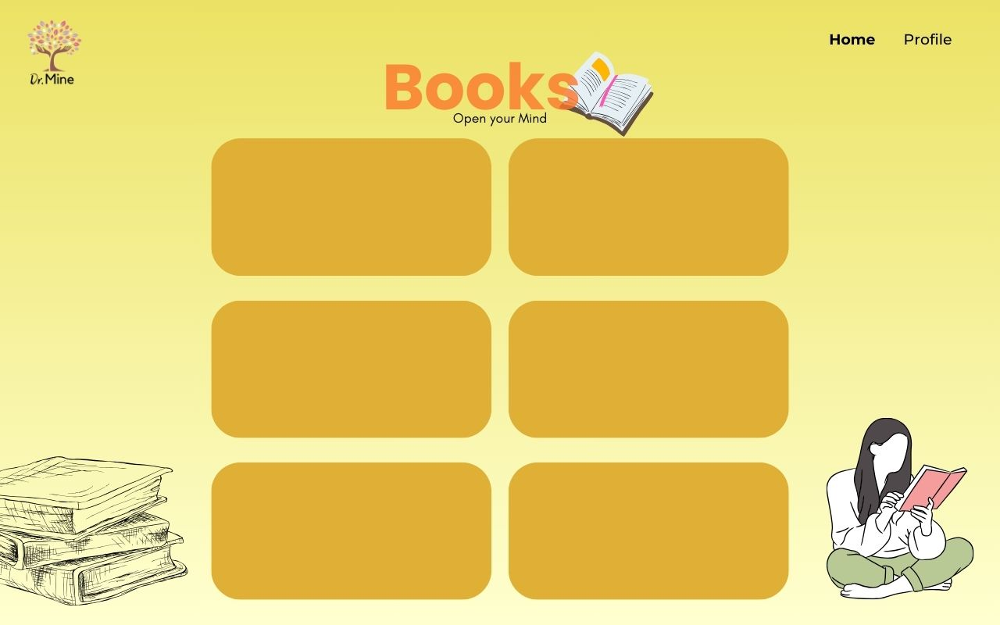
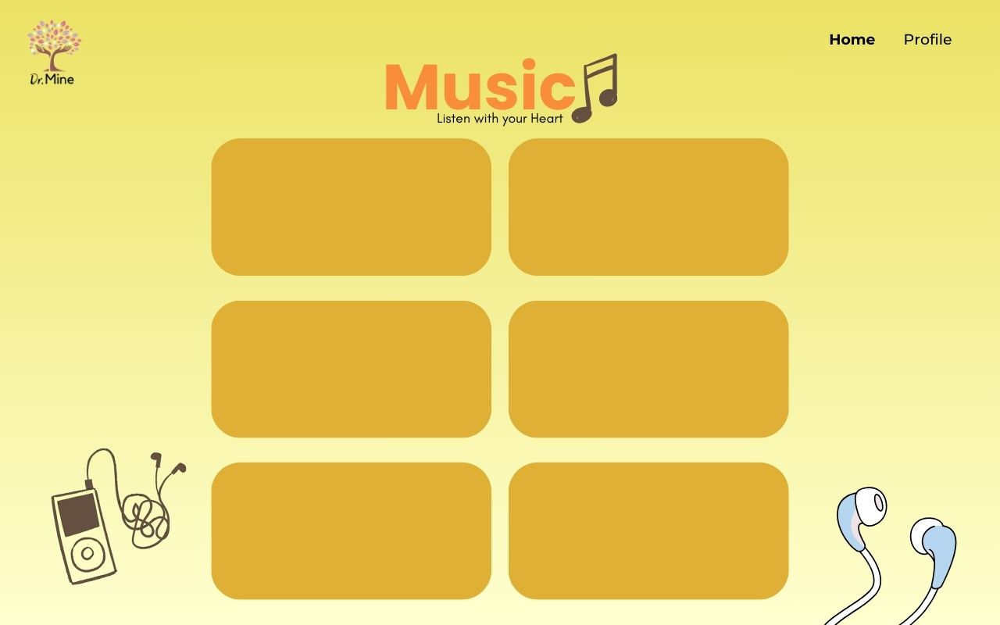
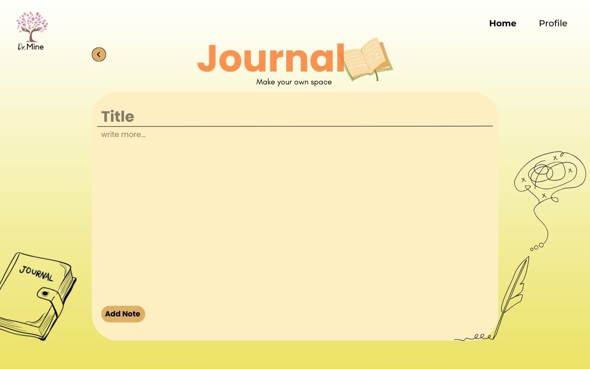

# web-application-for-mental-well-being


A web application that provides personalized recommendations for music, movies, and books based on the user's current mood. Features include user authentication, mood tracking, and a personal journal.


## Table of Contents
- [Features](#features)
- [Demo](#demo)
- [Technologies Used](#technologies-used)
- [Getting Started](#getting-started)
  - [Prerequisites](#prerequisites)
  - [Installation](#installation)
- [Usage](#usage)
- [Project Structure](#project-structure)
- [API Reference](#api-reference)
- [Contributing](#contributing)
- [License](#license)
- [Acknowledgements](#acknowledgements)
- [Contact](#contact)

## Features

- User registration and authentication
- Mood tracking and updates
- Personalized recommendations for music, movies, and books
- Personal journal for users to write and store entries
- User profile with mood history visualization
- AI chatbot for user interaction

## Demo

We apologize, but a demo or preview is not currently available for this project. We're working on creating a demonstration to showcase the features and functionality of our Mood-Based Recommendation System. In the meantime, please refer to the [Features](#features) section for an overview of what the project offers, and the [Screenshots](#screenshots) section for visual representations of key components.

If you're interested in seeing the project in action, we encourage you to follow the [Installation](#installation) instructions to set up and run the project locally.


### Screenshots










## Technologies Used

- Node.js
- Express.js
- MongoDB with Mongoose
- EJS (Embedded JavaScript templates)
- Google Charts (for mood history visualization)
- GSAP (GreenSock Animation Platform)

## Getting Started

These instructions will get you a copy of the project up and running on your local machine for development and testing purposes.

### Prerequisites

- Node.js (v14.0.0 or later)
- MongoDB

### Installation

1. Clone the repository:
   ```
   git clone https://github.com/Athrudev/web-app-for-mental-health-well-being.git
   ```

2. Navigate to the project directory:
   ```
   cd web-app-for-mental-health-well-being
   ```

3. Install dependencies:
   ```
   npm install
   ```

4. Start the server:
   ```
   npx nodemon
   ```

6. Open your browser and go to `http://localhost:3000`

## Usage

1. Register for an account or log in
2. Update your current mood
3. Explore personalized recommendations
4. Write in your journal
5. View your mood history in the profile section

## Project Structure

```
.
├── routes/
│   ├── index.js
│   └── user.js
├── models/
│   ├── user.js
│   └── notes.js
├── views/
│   ├── register.ejs
│   ├── login.ejs
│   ├── index.ejs
│   ├── recommend.ejs
│   ├── home.ejs
│   ├── journal.ejs
│   └── profile.ejs
├── public/
│   ├── css/
│   └── js/
├── data.js
├── app.js
├── package.json
└── README.md
```


## Contributing

Contributions are welcome! Please feel free to submit a Pull Request.

1. Fork the project
2. Create your feature branch (`git checkout -b feature/AmazingFeature`)
3. Commit your changes (`git commit -m 'Add some AmazingFeature'`)
4. Push to the branch (`git push origin feature/AmazingFeature`)
5. Open a Pull Request

## License

This project is licensed under the [MIT License](LICENSE).

## Acknowledgements

- [Express.js](https://expressjs.com/)
- [MongoDB](https://www.mongodb.com/)
- [EJS](https://ejs.co/)
- [Google Charts](https://developers.google.com/chart)
- [GSAP](https://greensock.com/gsap/)


## Contact

Gmail: athrudev.email@gmail.com

GitHub: [Your GitHub Profile](https://github.com/Athrudev)

Project Link: [https://github.com/Athrudev/web-app-for-mental-health-well-being](https://github.com/Athrudev/web-app-for-mental-health-well-being)
