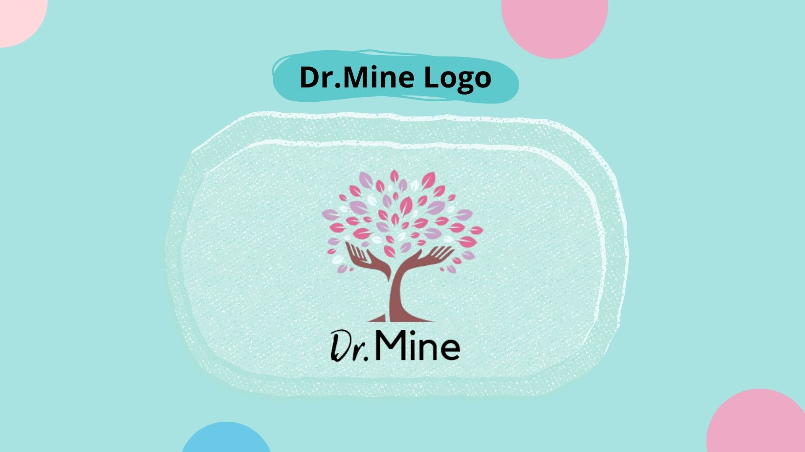
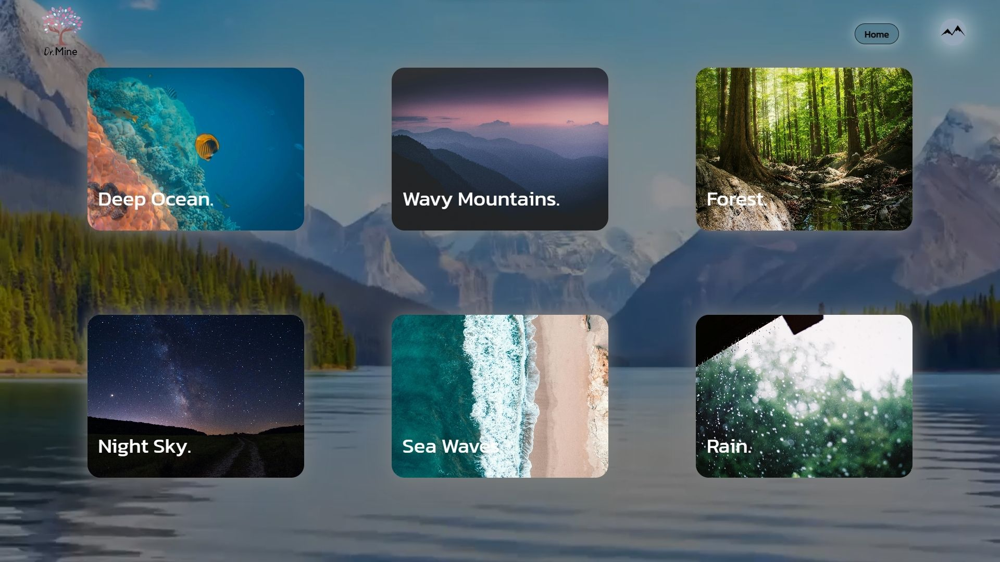
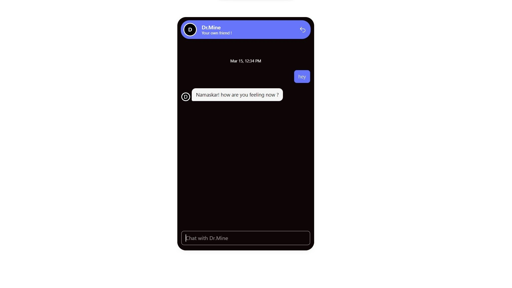

# web-application-for-mental-well-being


A web application that provides personalized recommendations for music, movies, and books based on the user's current mood. Features include user authentication, mood tracking, and a personal journal.



## Table of Contents
- [Features](#features)
- [Demo](#demo)
- [Technologies Used](#technologies-used)
- [Getting Started](#getting-started)
  - [Prerequisites](#prerequisites)
  - [Installation](#installation)
- [Usage](#usage)
- [Project Structure](#project-structure)
- [API Reference](#api-reference)
- [Contributing](#contributing)
- [License](#license)
- [Acknowledgements](#acknowledgements)
- [Contact](#contact)

## Built With

* [Express.js](https://expressjs.com/) - Web application framework
* [MongoDB](https://www.mongodb.com/) - Database
* [EJS](https://ejs.co/) - Templating engine
* [Google Charts](https://developers.google.com/chart) - Used for data visualization
* [GSAP](https://greensock.com/gsap/) - Animation library


## Features

- User registration and authentication
- Mood tracking and updates
- Personalized recommendations for music, movies, and books
- Personal journal for users to write and store entries
- User profile with mood history visualization
- AI chatbot for user interaction

## Demo

We apologize, but a demo or preview is not currently available for this project. We're working on creating a demonstration to showcase the features and functionality of our Mood-Based Recommendation System. In the meantime, please refer to the [Features](#features) section for an overview of what the project offers, and the [Screenshots](#screenshots) section for visual representations of key components.

If you're interested in seeing the project in action, we encourage you to follow the [Installation](#installation) instructions to set up and run the project locally.


### Screenshots






## Technologies Used

- Node.js
- Express.js
- MongoDB with Mongoose
- EJS (Embedded JavaScript templates)
- Google Charts (for mood history visualization)
- GSAP (GreenSock Animation Platform)

## Getting Started

These instructions will get you a copy of the project up and running on your local machine for development and testing purposes.

### Prerequisites

- Node.js (v14.0.0 or later)
- MongoDB

### Installation

1. Clone the repository:
   ```
   git clone https://github.com/Athrudev/web-app-for-mental-health-well-being.git
   ```

2. Navigate to the project directory:
   ```
   cd web-app-for-mental-health-well-being
   ```

3. Install dependencies:
   ```
   npm install
   ```

4. Start the server:
   ```
   npx nodemon
   ```

6. Open your browser and go to `http://localhost:3000`


## Documentation

For detailed information about the project's architecture, functionality, and implementation details, please refer to our comprehensive project documentation:

[Project Working PDF](https://github.com/Athrudev/web-app-for-mental-health-well-being/raw/main/docs/mega_project_working.pdf)

This document provides in-depth explanations of:

- Project structure and organization
- Detailed breakdown of each component
- Database schema and relationships
- API endpoints and their usage
- Step-by-step guide for setup and deployment
- Troubleshooting common issues

We highly recommend reviewing this documentation to gain a thorough understanding of the project's inner workings and to assist with any development or customization efforts.****

## Large Video Files

Due to GitHub's file size limitations, we were unable to include our video files directly in the repository. However, we have made these essential video assets available via Google Drive. To fully experience all features of the application, please follow these steps:

1. Download the video files from our Google Drive link: [Video Files for Mental Health Web App](INSERT_YOUR_GOOGLE_DRIVE_LINK_HERE)

2. After downloading, place the video files in the following directory of your local copy of the repository:
   ```
   public/video/
   ```

3. Ensure that the video file names match those referenced in the application code. If you encounter any issues with file names, please check the relevant code sections and adjust accordingly.

By following these steps, you'll have the complete set of assets needed to run the application as intended. We apologize for any inconvenience this extra step may cause and appreciate your understanding.

If you encounter any issues or have questions about integrating these video files, please don't hesitate to open an issue in this repository or contact us directly.

## Usage

1. Register for an account or log in
2. Update your current mood
3. Explore personalized recommendations
4. Write in your journal
5. View your mood history in the profile section

## Project Structure

```
.
├── routes/
│   ├── index.js
│   └── user.js
├── models/
│   ├── user.js
│   └── notes.js
├── views/
│   ├── register.ejs
│   ├── login.ejs
│   ├── index.ejs
│   ├── recommend.ejs
│   ├── home.ejs
│   ├── journal.ejs
│   └── profile.ejs
├── public/
│   ├── css/
│   └── js/
├── data.js
├── app.js
├── package.json
└── README.md
```


## Contributing

Contributions are welcome! Please feel free to submit a Pull Request.

1. Fork the project
2. Create your feature branch (`git checkout -b feature/AmazingFeature`)
3. Commit your changes (`git commit -m 'Add some AmazingFeature'`)
4. Push to the branch (`git push origin feature/AmazingFeature`)
5. Open a Pull Request

## License

This project is licensed under the [MIT License](LICENSE).

## Acknowledgements

- [Express.js](https://expressjs.com/)
- [MongoDB](https://www.mongodb.com/)
- [EJS](https://ejs.co/)
- [Google Charts](https://developers.google.com/chart)
- [GSAP](https://greensock.com/gsap/)


## Contact

Gmail: athrudev.email@gmail.com

GitHub: [Link](https://github.com/Athrudev)

Project Link: [Link](https://github.com/Athrudev/web-app-for-mental-health-well-being)


## Note on Assets

Due to the large file sizes of certain audio and video assets, we were unable to include them in this repository. When you run this project locally, you may need to add your own audio and video files to fully experience all features.

To add your own assets:

1. Navigate to the `public/` directory (create it if it doesn't exist)
2. Add your audio files to `public/audio/`
3. Add your video files to `public/video/`
4. Update any references to these files in the codebase to match your file names

We apologize for any inconvenience this may cause. If you have any questions about integrating your own media assets, please open an issue in this repository.


## Support

If you are having issues, please let us know.
We have a mailing list located at: athrudev@gmail.com
